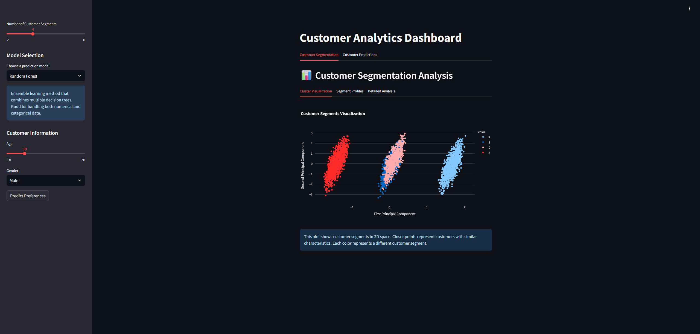
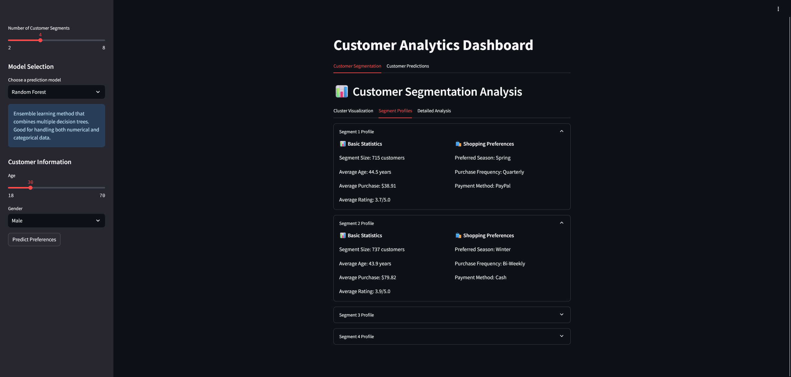
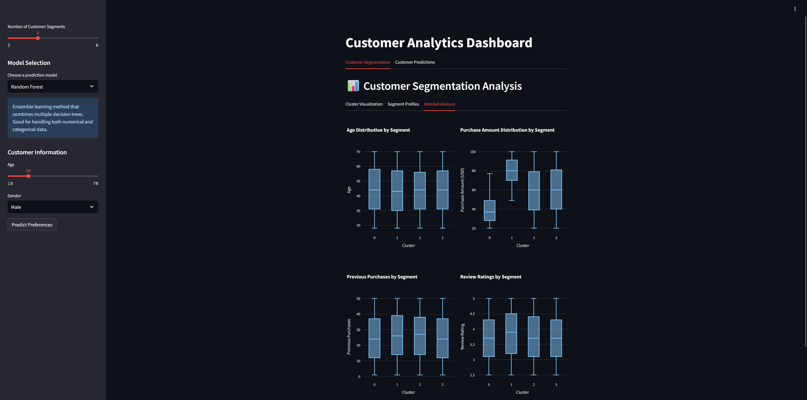
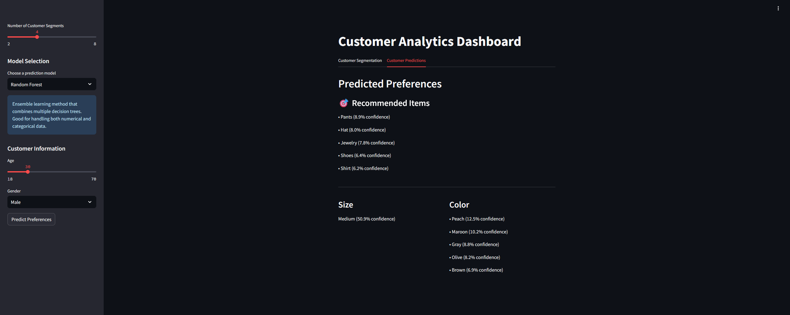

# Seminar Project - Customer Segmentation

This project involves analysing a dataset of customers and segmenting them into different groups based on their purchasing behaviour. The dataset contains information about the customers and their purchasing behaviour. The goal of this project is to identify different customer segments and understand their purchasing behaviour.

## Dataset

The dataset contains the following columns:

- Customer ID - Unique identifier for each customer
- Age - Age of the customer
- Gender - Gender of the customer (Male/Female)
- Item Purchased - The item purchased by the customer
- Category - Category of the item purchased
- Purchase Amount (USD) - The amount of the purchase in USD
- Location - Location where the purchase was made
- Size - Size of the purchased item
- Color - Color of the purchased item
- Season - Season during which the purchase was made
- Review Rating - Rating given by the customer for the purchased item
- Subscription Status - Indicates if the customer has a subscription (Yes/No)
- Shipping Type - Type of shipping chosen by the customer
- Discount Applied - Indicates if a discount was applied to the purchase (Yes/No)
- Promo Code Used - Indicates if a promo code was used for the purchase (Yes/No)
- Previous Purchases - The total count of transactions concluded by the customer at the store, excluding the ongoing transaction
- Payment Method - Customer's most preferred payment method
- Frequency of Purchases - Frequency at which the customer makes purchases (e.g., Weekly, Fortnightly, Monthly)

Link: [Kaggle](https://www.kaggle.com/datasets/iamsouravbanerjee/customer-shopping-trends-dataset)

## Approach

First we will explore the dataset to understand the data and identify any patterns or trends. We will then preprocess the data by handling missing values, encoding categorical variables, and scaling numerical features. Next, we will apply clustering algorithms to segment the customers based on their purchasing behaviour. Finally, we will evaluate the performance of the clustering algorithms and interpret the results.

##  Screenshots

## Running
Steps:
1. Clone the repository
2. Install the required libraries using `pip install -r requirements.txt`
3. For EDA, check out the EDA.ipynb
4. Then run the streamlit app using `streamlit run app.py`
5. The app will open in your default browser

You can also check out a pre-deployed version of this app [here](https://chiggy-seminar.streamlit.app/)